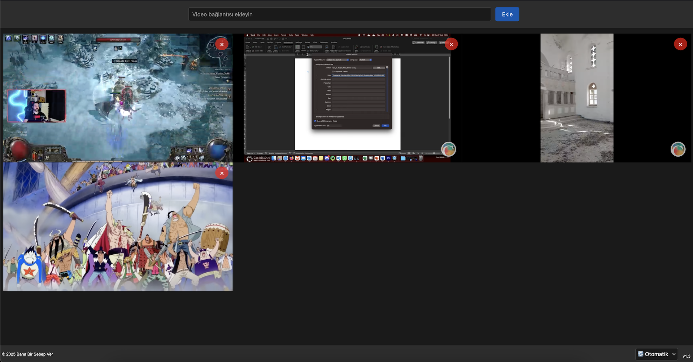
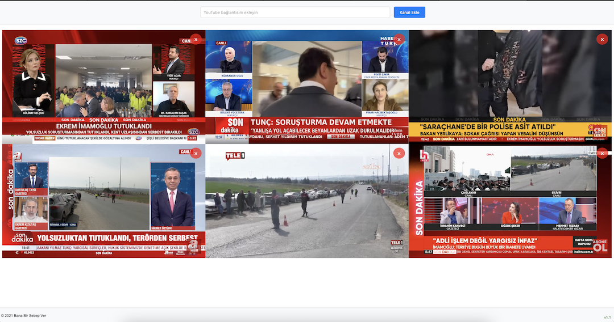

# KANALLAR
Bu proje, internet yayınlarını tek bir ekranda izlemek için yapılmıştır. Kullanıcılar, istedikleri videoları ve canlı yayınları tek bir ekranda izleyebilirler. Proje, kullanıcıların medya takibi yapmalarına ve yayıncıların farklı yayınları tek bir ekranda izlemelerine olanak tanır.

## Kimler İçin?
- Medya takipçileri
- Yayıncılar

## Platformlar
- [x] YouTube
- [x] Twitch
- [ ] TikTok

## Nasıl Kullanılır?
1. YouTube için video bağlantısını ekleyin.
2. Twitch için kanal bağlantısını ekleyin.
3. Eklediğiniz kanalları silebilirsiniz.

### v1.3
YouTube ile birlikte Twitch kanallarını da eklenebilir. Bu sayede hem YouTube hem de Twitch yayınları izlenebilir.
- [x] Platformlar için farklı js kodları
- [x] YouTube videolarını bağlantı olarak ekleme
- [x] Twitch kanallarını bağlantı olarak ekleme
- [x] Stil üzerinde değişiklikler

### v1.2.1
- [x] YouTube video URL'lerinin farklı formatlarını destekler.

### v1.2
- [x] Çerez ile son eklenen ve silinen kanallar kaydedilir.
- [x] Kanal eklendiğinde otomatik olarak çalışır.
- [x] Tema modu eklenmiştir. (Açık/Koyu/Otomatik)

### v1.1
- [x] Mobil cihazlarda kullanımı kolaylaştırmak için tasarım güncellendi.
- [x] Stil dosyaları düzenlendi.
- [x] Versiyon bilgisi eklendi.

### v1.0
- [x] Kanal ekleme
- [x] Kanal silme
