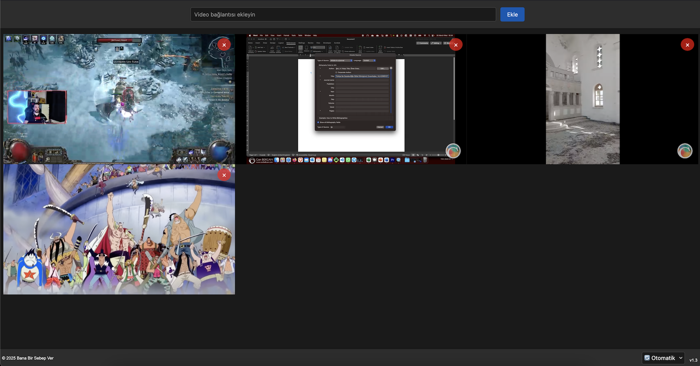
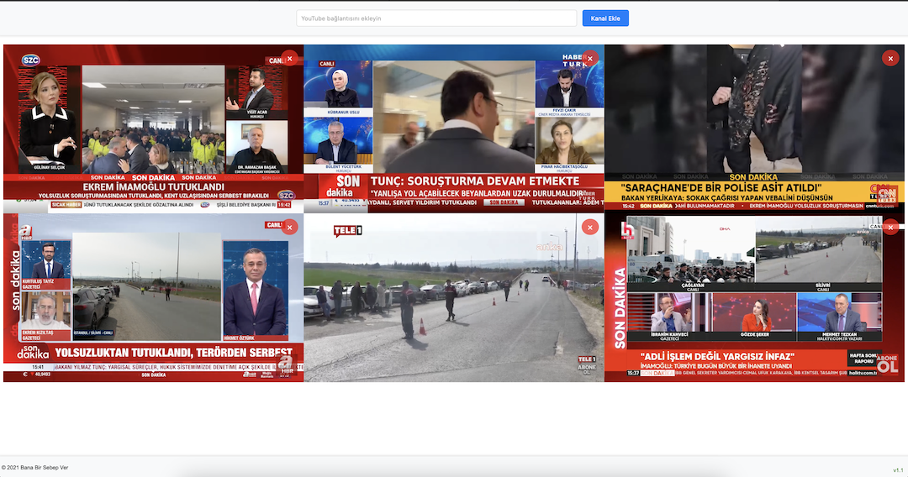

# KANALLAR
Bu proje, internet yayınlarını tek bir ekranda izlemek için yapılmıştır. Kullanıcılar, istedikleri videoları ve canlı yayınları tek bir ekranda izleyebilirler. Proje, kullanıcıların medya takibi yapmalarına ve yayıncıların farklı yayınları tek bir ekranda izlemelerine olanak tanır.

**Discord Sunucusu:** [https://discord.gg/WZ8xkMmw2A](https://discord.gg/WZ8xkMmw2A)


## Kimler İçin?
- Medya takipçileri
- Yayıncılar

> [!CAUTION]
> Yapacağınız katkılar için lütfen "update" paketini kullanın. Bu sayede, projenin güncel kalmasını sağlayabilirsiniz.

## Platformlar
- [x] YouTube
- [x] Twitch
- [x] Kick
- [ ] TikTok (Planlanıyor)

## Nasıl Kullanılır?
1. YouTube için video bağlantısını ekleyin.
2. Twitch için kanal bağlantısını ekleyin.
3. Kick için kanal bağlantısını ekleyin.
4. Eklediğiniz kanalları silebilirsiniz.


## Kurulum ve Konfigürasyon

Bu projeyi kendi sunucunuzda çalıştırmak için aşağıdaki adımları sırasıyla uygulamanız gerekmektedir:

### 1. Veritabanı Kurulumu
Projenin verileri kaydedebilmesi için bir MySQL veritabanına ihtiyacınız vardır.
* Sunucunuzda (cPanel/DirectAdmin vb.) yeni bir veritabanı ve kullanıcı oluşturun.
* Veritabanı tablolarını oluşturmak için gerekli SQL şemasını phpMyAdmin üzerinden içe aktarın (Import).

### 2. Ortam Değişkenleri (.env)
Güvenlik nedeniyle veritabanı şifreleri ve API anahtarları kod içerisinde yer almaz. Projenin ana dizininde (`index.php` ile aynı yerde) bir `.env` dosyası oluşturun ve aşağıdaki bilgileri kendi sisteminize göre doldurun:

```env
DB_HOST=localhost
DB_NAME=veritabani_adiniz
DB_USER=kullanici_adiniz
DB_PASS=sifreniz
GOOGLE_CLIENT_ID=sizin_google_client_id_niz
```
Not: Güvenliğiniz için .env dosyasının GitHub'a yüklenmemesi adına .gitignore dosyanızda .env ibaresinin bulunduğundan emin olun.

### 3. Otomatik Dağıtım (GitHub Actions ile FTP)
Projeyi her gönderimde (push) otomatik olarak sunucunuza yüklemek için GitHub deponuzda Settings > Secrets and variables > Actions yolunu izleyin ve şu değişkenleri (Repository secrets) tanımlayın:
FTP_SERVER: Sunucu IP adresiniz veya ana host adınız
FTP_USERNAME: FTP kullanıcı adınız
FTP_PASSWORD: FTP şifreniz


## Kullanılan Teknolojiler
Bu proje, bağımlılıkları minimumda tutmak ve yüksek performans sağlamak amacıyla modern ancak temel web teknolojileri kullanılarak geliştirilmiştir:
- **Frontend (Önyüz):** HTML5, CSS3, Vanilla JavaScript (Herhangi bir harici kütüphane kullanılmamıştır)
- **Backend (Arkayüz):** PHP (PDO ile güvenli veritabanı mimarisi)
- **Veritabanı:** MySQL
- **Kimlik Doğrulama:** Google Identity Services API (Şifresiz, güvenli giriş)
- **Otomasyon (CI/CD):** GitHub Actions ile otomatik FTP dağıtımı

## Katkıda Bulunma
Bu proje açık kaynaklıdır ve her türlü katkıya (hata düzeltmeleri, yeni özellikler, dokümantasyon iyileştirmeleri) açıktır. Katkıda bulunmak isterseniz:
1. Projeyi çatallayın (Fork).
2. Yeni bir dal (branch) oluşturun (`git checkout -b ozellik/YeniOzellik`).
3. Değişikliklerinizi yapın ve test edin.
4. "update" paketini kullanarak değişikliklerinizi gönderin (Commit).
5. Bir Çekme İsteği (Pull Request) oluşturun.

Karşılaştığınız hataları veya yeni fikirlerinizi [Issues](../../issues) sekmesinden bildirebilirsiniz.

## Lisans
Bu proje [MIT Lisansı](https://opensource.org/licenses/MIT) altında lisanslanmıştır. 
Kodları özgürce kopyalayabilir, değiştirebilir, dağıtabilir ve kendi kişisel veya ticari projelerinizde kullanabilirsiniz. Sadece orijinal lisans metnini ve telif hakkı bildirimini projenizde bulundurmanız yeterlidir.

## Sürüm Geçmişi (Changelog)

> 🚀 **Güncel Sürüm Notları:** 
> Projemizin CI/CD (Sürekli Entegrasyon ve Dağıtım) otomasyonuna geçmesiyle birlikte, v1.4.0 sürümünden sonraki tüm geliştirmeler, hata düzeltmeleri ve yenilikler anlık olarak GitHub üzerinde kayıt altına alınmaktadır.
> 
> 🔗 **[En Güncel Sürüm Geçmişini ve Yapılan Tüm Değişiklikleri (Commits) Buradan Takip Edebilirsiniz](https://github.com/BanaBirSebepVer/Kanallar/commits/main)**

### v1.4.0
Bu sürümle birlikte projenin altyapısı statik bir sayfadan, veritabanı destekli dinamik bir web uygulamasına dönüştürülmüştür.
- [x] **Kimlik Doğrulama:** Google Identity Services ile şifresiz ve güvenli kullanıcı girişi eklendi.
- [x] **Bulut Senkronizasyonu:** Kullanıcıların yerel video geçmişlerini veritabanına yedekleme ve geri yükleme özelliği getirildi.
- [x] **Liste Paylaşımı:** Ekranda açık olan videoları özel bir URL ile başkalarına gönderebilme (Paylaş) işlevi eklendi.
- [x] **Lider Tablosu:** En çok izlenen paylaşımlı listelerin sıralandığı aylık "Lider Tablosu" arayüzü kuruldu.
- [x] **Güvenlik Mimarisi:** Veritabanı ve API şifreleri `.env` dosyasıyla izole edilerek güvenli hale getirildi.
- [x] **Dinamik Sürüm Takibi:** Sayfa altındaki sürüm bilgisinin doğrudan GitHub API üzerinden anlık commit numarasıyla çekilmesi sağlandı.
- [x] **CI/CD Otomasyonu:** GitHub Actions entegrasyonu kurularak her gönderimde (push) sunucuya otomatik FTP dağıtımı aktif edildi.

### v1.3.2
- [x] Fon resmi ekleme ve değiştirme özelliği eklendi.

### v1.3.1
- [x] Kick kanalları eklenebilir. Bu sayede Kick yayınları izlenebilir.

### v1.3
YouTube ile birlikte Twitch kanallarını da eklenebilir. Bu sayede hem YouTube hem de Twitch yayınları izlenebilir.
- [x] Platformlar için farklı js kodları
- [x] YouTube videolarını bağlantı olarak ekleme
- [x] Twitch kanallarını bağlantı olarak ekleme
- [x] Stil üzerinde değişiklikler



### v1.2.1
- [x] YouTube video URL'lerinin farklı formatlarını destekler.

### v1.2
- [x] Çerez ile son eklenen ve silinen kanallar kaydedilir.
- [x] Kanal eklendiğinde otomatik olarak çalışır.
- [x] Tema modu eklenmiştir. (Açık/Koyu/Otomatik)

### v1.1
- [x] Mobil cihazlarda kullanımı kolaylaştırmak için tasarım güncellendi.
- [x] Stil dosyaları düzenlendi.
- [x] Versiyon bilgisi eklendi.



### v1.0
- [x] Kanal ekleme
- [x] Kanal silme
